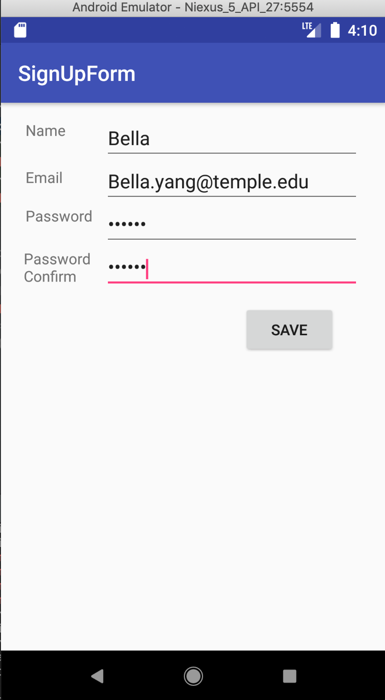
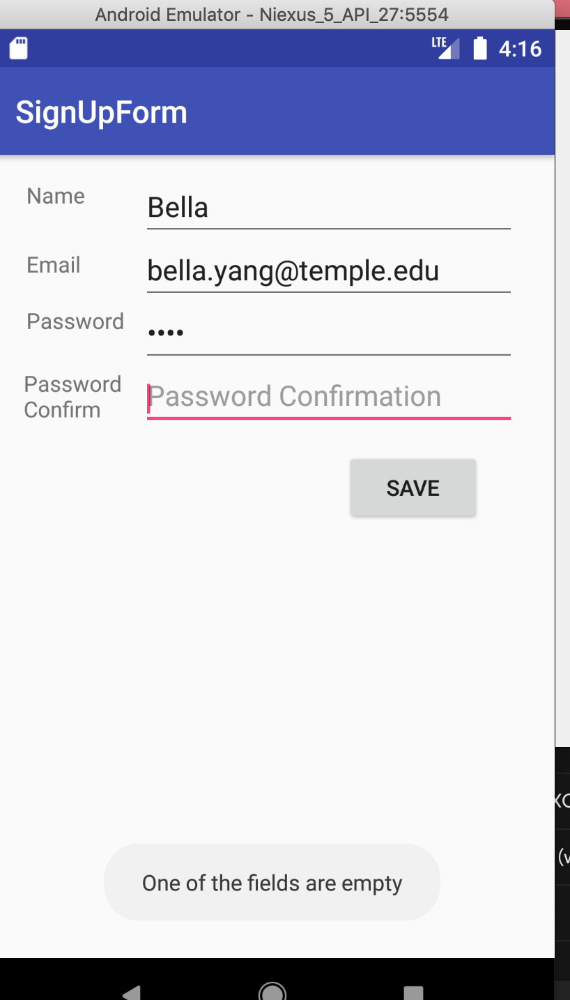
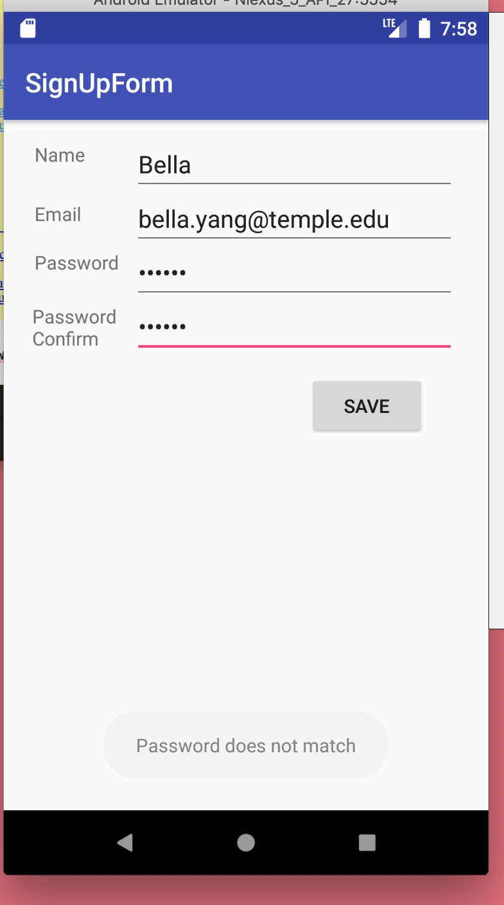
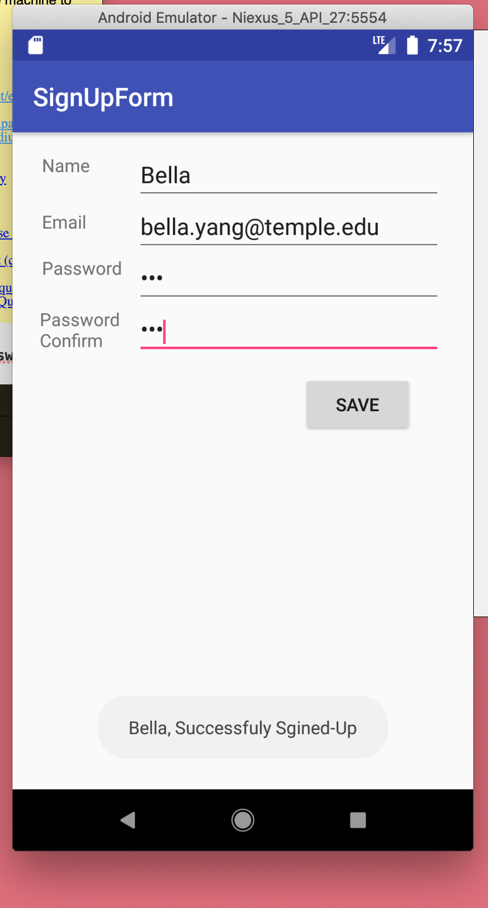

# SignUpFormLab2
implementation document 

<b>SignUpForm Lab2 Documentation Readme.md</b>

This project is an Android application that collects a user's name, email, a password, and a password confirmation. It also contains a Save button. 
The app displays a message containing the use's name, welcoming them to the app. 

The project is useful because it creates an login session with several different handlers. It helps create login accounts.
1. the login checks if any field is empty 
2. the login checks and compares password and password confirmation to make sure they match
      a. If the passwords does not match, the app displays a toast telling the user that they password doesnot match.
3. If all user's name is complete and the masswords match then the users name concatenated with the message will display in the Toast.

The users can get started with the project by reading this documentaiton and the comments made in the code.

The users can get help with the project through contacting bella.yang@temple.edu. 

Bella yang maintains and contrubtes to the project.

Below is the screenshots for the user using the emulator and different outputs. 

